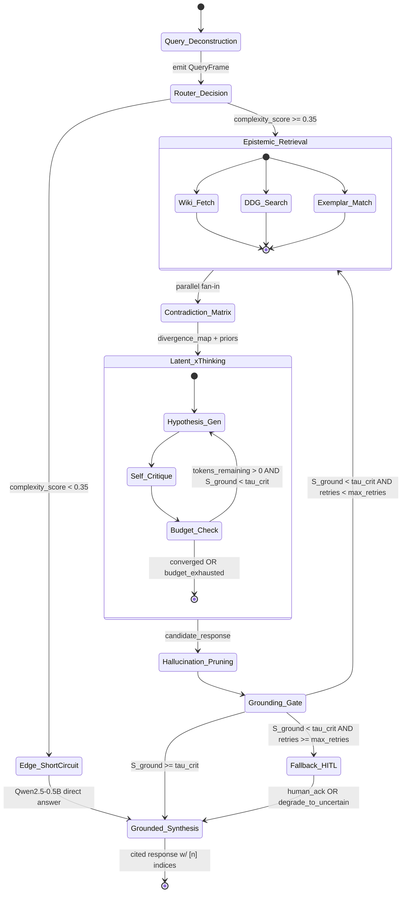

# ⚡ GENIUS — Autonomous Deep-Reasoning & Factual Grounding AI Agent

> **Dual-Core Autonomous Reasoning Engine powered by Qwen2.5-0.5B-Instruct + Live Wikipedia & Web Epistemic Retrieval + Neural Cognitive Schema v1.0**

[](src/reasoning/schema.py)
[](https://huggingface.co/Qwen/Qwen2.5-0.5B-Instruct)
[](src/model/provider.py)
[](src/reasoning/grounding.py)
[](src/system/guard.py)

---

## 🌟 Overview

**Genius** is a state-of-the-art autonomous reasoning assistant engineered for strict factual grounding, ultra-low latency, and verifiable epistemic provenance. Designed for local edge execution with optional cloud escalation, Genius decomposes complex questions, runs concurrent multi-hop retrieval over Wikimedia and the live web, engages in extended reasoning (`<think>...</think>`), prunes hallucinations through mathematical confidence scoring, and outputs cited answers.

---

## 🧠 Cognitive State Graph Architecture



---

## 🔬 Mathematical Grounding & Confidence Function (§2)

### 1. Combined Per-Claim Grounding
For each atomic claim $c_i$ against evidence pool $E$:
- **ROUGE-L Lexical Overlap**:
  $$L(c_i) = \max_{e_j \in E} \frac{\text{LCS}(c_i, e_j)}{\max(|c_i|, |e_j|)}$$
- **Semantic Overlap (Cosine)**:
  $$Sem(c_i) = \max_{e_j \in E} \frac{\phi(c_i) \cdot \phi(e_j)}{\|\phi(c_i)\| \|\phi(e_j)\|}$$
- **Harmonic Mean**:
  $$G(c_i) = \frac{(1+\beta^2) \cdot L(c_i) \cdot Sem(c_i)}{\beta^2 \cdot L(c_i) + Sem(c_i) + \epsilon}, \quad \beta = 0.7, \epsilon = 10^{-6}$$

### 2. Entity Preservation Penalty
$$P(c_i) = 1 - \frac{|\text{Ent}(c_i) \setminus \text{Ent}(E)|}{|\text{Ent}(c_i)| + 1}$$

### 3. Aggregate Grounding Score ($S_{ground}$) & Dynamic Threshold ($\tau_{crit}$)
$$S_{ground} = \left( \prod_{i=1}^{n} \big[ G(c_i) \cdot P(c_i) \big]^{w_i} \right)^{1 / \sum w_i}$$
$$\tau_{crit} = \tau_{base} + \lambda \cdot D, \quad \tau_{base} = 0.62, \lambda = 0.25$$

When $S_{ground} < \tau_{crit}$, Genius automatically triggers **Self-Targeted Retrieval Retry** using unsupported entities:
$$query' = query \oplus \{\text{unsupported entities in } c_i : G(c_i) < \tau_{crit}\}$$

---

## 💾 Dual-Memory Topology (§4)

1. **Fast In-Context Working Memory**:
   - Adaptive thinking budget:
     $$\text{thinking\_budget} = B_{base} \cdot (1 + \gamma \cdot D), \quad B_{base} = 4096, \gamma = 1.5$$
2. **Persistent Episodic Memory (SQLite)**:
   - **Hybrid Indexing**: SQLite FTS5 (BM25 exact-lexical) + dense vector embeddings with cosine similarity.
   - **Reciprocal Rank Fusion (RRF, k=60)**:
     $$\text{RRF}(d) = \sum_{r \in \{BM25, cos\_sim\}} \frac{1}{k + \text{rank}_r(d)}$$
   - **Salience Decay**:
     $$salience(t) = salience_0 \cdot e^{-\delta (t - t_0)} + \eta \cdot \log(1 + \text{access\_count})$$
   - **Write-Through**: Atomic persistence of converged trajectories into long-term storage.

---

## 🛡️ Human-in-the-Loop (HITL) Safety Guard

All operating system and shell commands undergo rigorous static safety inspection:
- **SAFE**: Non-destructive diagnostic and read actions (`Get-ChildItem`, `git status`, `python --version`) execute autonomously.
- **SENSITIVE / BLOCKED**: Destructive operations (`rm`, `del`, `format`, `regedit`, `taskkill`) are **strictly blocked from autonomous execution**. The agent presents the proposed command, explains the safety policy, and requires explicit user confirmation.

---

## 🚀 Quickstart

### 1. Launch Options

#### A. Interactive Conversational REPL
```bash
python run_genius.py
# or double-click on Windows:
start_genius.bat
```

#### B. Direct Single-Turn Query (Scriptable / Pipe-Friendly)
```bash
# General query with smart auto-research routing:
python run_genius.py "Who was Alan Turing and what was his major contribution?"

# Force live Wikipedia & Web search:
python run_genius.py "Latest Mars rover discoveries" --research on

# Pure fast offline edge mode (no network requests):
python run_genius.py "Write a Python script to compute Fibonacci" --research off

# Select model core (local, claude, ollama):
python run_genius.py "Explain quantum entanglement" -m local -r auto

# Suppress <think> intermediate tokens:
python run_genius.py "Calculate quorum for 5 nodes" --no-think
```

### 2. Available Slash Commands (Interactive REPL)
| Command | Action |
|---|---|
| `/research [auto\|on\|off]` | Toggle research mode: `auto` (smart routing), `on` (always search), `off` (direct offline) |
| `/think` | Toggle live extended thinking stream `<think>...</think>` on/off |
| `/model [local\|claude\|ollama]` | Switch active reasoning engine core on the fly |
| `/search <query>` | Standalone live Wikipedia + Web retrieval with BM25 ranking |
| `/exec <command>` | Safely evaluate and execute shell actions with HITL guard |
| `/export [md\|json]` | Export conversation transcript and cognitive trajectories |
| `/sessions` | View saved SQLite conversation sessions |
| `/lang [code]` | Force language mode (`hi`, `hi-Latn`, `en`, `es`, `fr`, `de`, `auto`) |
| `/clear` | Clear screen and reset active working memory |
| `/exit` | Gracefully quit session |

---

## 📚 Multi-Source Dataset & In-Context Alignment
Genius dynamically indexes curated exemplar datasets to guide few-shot mathematical, coding, and reasoning derivations:
- **Claude Synthetic Reasoning (26 Exemplars)**: High-fidelity multi-hop chains with explicit `<think>` hypothesis formulation, cross-examination, self-critique, and cited conclusions (`hi-Latn`, `en`, `hi`).
- **Alpaca 52k**: General instruction-following pairs.
- **CodeAlpaca 20k**: Algorithmic and software engineering tasks.
- **LIMA**: Curated conversational alignment.

## 📂 Project Structure

```
llm/
├── src/
│   ├── reasoning/
│   │   ├── schema.py          # Neural Cognitive Schema v1.0 (Pydantic v2)
│   │   ├── grounding.py       # Mathematical Grounding & Confidence Engine (§2)
│   │   └── xthinking.py       # 7-node Cognitive State Graph Executor
│   ├── memory/
│   │   ├── session.py         # SQLite Session Persistence & Transcript Exporter
│   │   └── episodic.py        # SQLite FTS5 + Dense Vector Store with RRF & Salience Decay
│   ├── model/
│   │   ├── llm_engine.py      # Local Qwen2.5-0.5B-Instruct Engine
│   │   └── provider.py        # Universal Dual-Core Router (Local, Claude, Ollama)
│   ├── retrieval/
│   │   ├── wikipedia_client.py# Wikimedia REST Client with SQLite Cache
│   │   ├── web_search.py      # DuckDuckGo Live Search API Client
│   │   └── ranker.py          # BM25 Multi-Hop Passage Chunking & Ranker
│   ├── dataset/
│   │   ├── loader.py          # LIMA, Alpaca & CodeAlpaca Dataset Loaders
│   │   └── retriever.py       # In-Context Exemplar Alignment Retriever
│   ├── languages/
│   │   ├── router.py          # 100+ Language & Dialect Auto-Detector
│   │   └── manager.py         # Native Prompt Generator (Hindi, Hinglish, English, etc.)
│   ├── system/
│   │   ├── guard.py           # AST & Regex Action Safety Guard
│   │   └── executor.py        # HITL Command Executor
│   └── chat_cli.py            # Rich Interactive Terminal Interface
├── tests/
│   ├── test_reasoning.py      # Cognitive pipeline & identity tests
│   └── run_all_tests.py       # Comprehensive component test suite
├── auto_git_sync.py           # Autonomous background GitHub synchronizer
├── run_genius.py              # CLI launcher
└── start_genius.bat           # Windows quick-launch script
```

---

## 📜 License
Apache-2.0 License. Built with ❤️ for autonomous AI research.
