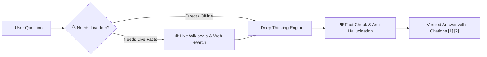

# ⚡ GENIUS AI

### The Autonomous Deep-Reasoning AI that Thinks, Fact-Checks in Real Time, and Runs 100% Locally on Your Computer

[](LICENSE)
[](https://www.python.org/)
[](src/model/provider.py)
[](src/retrieval/)
[](src/languages/)
[](setup.bat)

---

## 🌟 What is Genius AI?

Most AI assistants guess or hallucinate when they do not know the answer. 

**Genius AI** is fundamentally different:
1. **It Thinks Step-by-Step (`<think>`)**: Before giving an answer, Genius breaks problems down, formulates hypotheses, tests edge cases, and self-corrects in real time (similar to DeepSeek-R1 and OpenAI o1).
2. **It Fact-Checks Everything**: It queries live Wikipedia and the web to cross-examine its own thoughts and cite authoritative sources.
3. **It Runs 100% Locally on Your Laptop / PC**: Powered by ultra-efficient edge models (Qwen2.5-0.5B), Genius runs smoothly on everyday CPUs with less than 1GB RAM — **no expensive GPU, subscription, or API keys needed**!
4. **It Understands You Naturally**: Native multilingual fluency in Hinglish (*"5 nodes mein quorum write consistency kaise ensure karein?"*), Hindi, English, and 100+ languages.

---

## ✨ Key Features at a Glance

| Feature | Description |
|---|---|
| 🧠 **Extended Thinking (`<think>`)** | Deep cognitive reflection with live streamable thoughts, hypothesis formulation, and self-critique. |
| 🌐 **Live Epistemic Retrieval** | Parallel multi-hop retrieval over Wikimedia and DuckDuckGo to provide verified answers with inline `[1]`, `[2]` citations. |
| 💬 **Visual Chat Experience** | Rounded chat cards in your terminal or 1-click modern dark-mode browser view (`/chatview html`). |
| 📁 **Autonomous Workspace** | Shift into any project directory, create, read, and edit code files, inspect image dimensions, and launch native image viewers. |
| 🎨 **No-Code Custom Instructions** | Drop custom `.md` persona or rules into `data/instructions/` and Genius adopts them instantly without coding! |
| ⚡ **Dual-Core Architecture** | Runs 100% offline on your local CPU by default, with seamless one-command escalation to Claude 3.5 or local Ollama. |
| 🛡️ **Built-in Safety Guard** | AST-level safety filter preventing accidental execution of destructive shell actions with Human-in-the-Loop confirmation. |

---

## 🚀 60-Second Quickstart

### 🪟 Windows (1-Click Automated Setup)

1. **Setup**: Double-click `setup.bat` (creates virtual environment and installs all dependencies automatically).
2. **Launch**: Double-click `start_genius.bat` to launch the interactive terminal chat!

---

### 🐧 Linux / 🍎 macOS / Manual Setup

```bash
# 1. Clone the repository
git clone https://github.com/sharmashyama1988-eng/genius-ai.git
cd genius-ai

# 2. Create and activate a virtual environment
python3 -m venv .venv
source .venv/bin/activate  # On Windows: .venv\Scripts\activate

# 3. Install dependencies
pip install -r requirements.txt

# 4. Launch Genius AI
python run_genius.py
```

---

## 🎯 How Genius AI Thinks (Simplified Flow)



### The 4 Simple Steps Behind Every Answer:
1. **Understand**: Genius analyzes your question, detects language (English, Hindi, Hinglish, etc.), and evaluates complexity.
2. **Retrieve**: If recent or encyclopedic facts are needed, it pulls live data from Wikipedia and the web in parallel.
3. **Reason**: Inside `<think>...</think>`, Genius forms hypotheses, cross-examines solutions, and catches mistakes before speaking.
4. **Verify & Deliver**: It mathematically verifies that its response is backed by evidence and outputs a clean, cited answer.

---

## 💡 Usage Examples

### 1. Interactive Chat
```bash
python run_genius.py
```
Type your query in plain English or natural Hinglish:
```
Genius ❯ 5 nodes ke Raft cluster mein leader partition heal hone ke baad stale leader kaise detect hota hai?
```

### 2. Direct Single-Line Command (Scriptable)
```bash
# Fast offline answer
python run_genius.py "Solve (a+b)^2 and explain geometrically" --research off

# Force live search
python run_genius.py "Latest discoveries by James Webb Space Telescope" --research on

# Suppress thinking tokens for clean final output
python run_genius.py "Explain quantum entanglement in simple terms" --no-think
```

---

## 🎮 Interactive Slash Commands & Agentic Tools

> 📖 **Full Documentation**: For complete usage, examples, and options, see [COMMANDS.md](COMMANDS.md).

Genius AI v2.0 features **Claude Code-level autonomous execution**, git automation, and dynamic context:

| Category | Command | Description |
|---|---|---|
| 🤖 **Autonomous Agent** | `/agent <task>` | End-to-end coding loop — scans repo, creates/edits files, runs tests, fixes errors |
| 🔀 **Git Ops** | `/git [status\|commit\|push\|branch\|pr\|conflicts]` | Full git automation without leaving terminal |
| ⚙️ **Protocol Runner** | `/run [test\|dev\|build\|lint\|...]` | Execute registered commands defined in `protocol.txt` |
| 🔍 **Codebase Indexer** | `/index [symbol]` | Scan codebase, map symbols/functions, track references & imports |
| 🧠 **Dynamic Context** | `/context [small\|medium\|gemini\|ultra\|infinite]` | Adaptive context window — scale from 8K up to unlimited infinite archive |
| 🔄 **Model Router** | `/model [local:qwen-7b\|claude\|gemini\|ollama]` | Switch reasoning models with auto-detected context budgets |
| 🔎 **Live Search** | `/search <query>` | Perplexity-style live search with numbered inline citations |
| 📁 **Workspace** | `/project`, `/files`, `/read`, `/create`, `/view` | Navigate directories, inspect files, and view images |
| 💬 **Chat & Display** | `/chatview`, `/think`, `/lang`, `/stats`, `/calc`, `/code` | Toggle CoT thoughts, customize language, export HTML/markdown |
| ⚙️ **Session** | `/sessions`, `/new`, `/clear`, `/help`, `/exit` | Manage episodic chat sessions and memory |

---

## 🎨 Easy Customization: Add Your Own Rules & Persona

You can customize Genius AI **without modifying any code**:
1. Open the folder `data/instructions/`.
2. Add any `.md` file, for example `my_rules.md` or `coding_style.md`:
   ```markdown
   # My Rules
   - Always explain things with simple real-world analogies.
   - For programming, always use TypeScript and strict types.
   ```
3. Genius automatically loads your markdown files on startup and follows your guidelines!

---

## 📂 Project Structure

```
genius-ai/
├── data/
│   ├── datasets/              # Curated exemplar reasoning and instruction datasets
│   │   ├── genius_reasoning_exemplars.json  # Multi-hop CoT chains with <think>
│   │   ├── genius_code_instruct.json        # Algorithmic and software engineering pairs
│   │   └── genius_general_instruct.json     # General high-quality instruction pairs
│   └── instructions/          # User-customizable markdown instructions & personas
│       ├── README.md          # Guide on how to add custom rules
│       ├── system_persona.md  # Core persona guidelines
│       ├── custom_rules.md    # Operational preferences
│       └── coding_guidelines.md# Code quality standards
├── src/
│   ├── api/                   # REST / WebSocket server endpoints
│   ├── dataset/               # Dataset loaders and in-context exemplar matchers
│   ├── languages/             # 100+ Language & Dialect auto-router and prompt synthesizer
│   ├── memory/                # Persistent SQLite episodic memory and session manager
│   ├── model/                 # Local Qwen2.5 edge engine + Claude/Ollama cloud router
│   ├── reasoning/             # Cognitive graph executor, math solver, code solver, sanitizer
│   ├── retrieval/             # Live Wikipedia client, DuckDuckGo search, and BM25 ranker
│   ├── system/                # Workspace manager, image inspector, safety guard, chat viewer
│   └── chat_cli.py            # Rich interactive CLI with rounded cards & HTML exporter
├── COMMANDS.md                # Complete command reference & agentic guide
├── protocol.txt               # Configurable project command registry (/run <cmd>)
├── pyproject.toml             # Standard Python packaging specification
├── requirements.txt           # Python dependencies
├── setup.bat                  # 1-click Windows installation script
├── start_genius.bat           # 1-click Windows launcher script
├── run_genius.py              # Universal launcher entrypoint
├── LICENSE                    # Apache 2.0 Open Source License
└── README.md                  # Project documentation
```

---

<details>
<summary><b>🔬 Technical Deep Dive & Mathematical Formulations (Click to Expand)</b></summary>

<br>

### 1. Mathematical Grounding & Confidence Function (§2)

#### Atomic Claim Grounding
For each atomic claim $c_i$ extracted from candidate response against evidence pool $E$:
- **ROUGE-L Lexical Overlap**:
  $$L(c_i) = \max_{e_j \in E} \frac{\text{LCS}(c_i, e_j)}{\max(|c_i|, |e_j|)}$$
- **Semantic Overlap (Cosine)**:
  $$Sem(c_i) = \max_{e_j \in E} \frac{\phi(c_i) \cdot \phi(e_j)}{\|\phi(c_i)\| \|\phi(e_j)\|}$$
- **Harmonic Mean**:
  $$G(c_i) = \frac{(1+\beta^2) \cdot L(c_i) \cdot Sem(c_i)}{\beta^2 \cdot L(c_i) + Sem(c_i) + \epsilon}, \quad \beta = 0.7, \epsilon = 10^{-6}$$

#### Entity Preservation Penalty
$$P(c_i) = 1 - \frac{|\text{Ent}(c_i) \setminus \text{Ent}(E)|}{|\text{Ent}(c_i)| + 1}$$

#### Aggregate Grounding Score ($S_{ground}$) & Dynamic Threshold ($\tau_{crit}$)
$$S_{ground} = \left( \prod_{i=1}^{n} \big[ G(c_i) \cdot P(c_i) \big]^{w_i} \right)^{1 / \sum w_i}$$
$$\tau_{crit} = \tau_{base} + \lambda \cdot D, \quad \tau_{base} = 0.62, \lambda = 0.25$$

When $S_{ground} < \tau_{crit}$, Genius automatically triggers **Self-Targeted Retrieval Retry** using unsupported entities:
$$query' = query \oplus \{\text{unsupported entities in } c_i : G(c_i) < \tau_{crit}\}$$

---

### 2. Dual-Memory Topology (§4)

1. **Fast In-Context Working Memory**:
   - Adaptive thinking budget:
     $$\text{thinking\_budget} = B_{base} \cdot (1 + \gamma \cdot D), \quad B_{base} = 4096, \gamma = 1.5$$
2. **Persistent Episodic Memory (SQLite)**:
   - **Hybrid Indexing**: SQLite FTS5 (BM25 exact-lexical) + dense vector embeddings with cosine similarity.
   - **Reciprocal Rank Fusion (RRF, k=60)**:
     $$\text{RRF}(d) = \sum_{r \in \{BM25, cos\_sim\}} \frac{1}{k + \text{rank}_r(d)}$$
   - **Salience Decay**:
     $$salience(t) = salience_0 \cdot e^{-\delta (t - t_0)} + \eta \cdot \log(1 + \text{access\_count})$$

</details>

---

## 📜 License

Distributed under the **Apache-2.0 License**. See [LICENSE](LICENSE) for more information.

Built with ❤️ for autonomous AI research.
