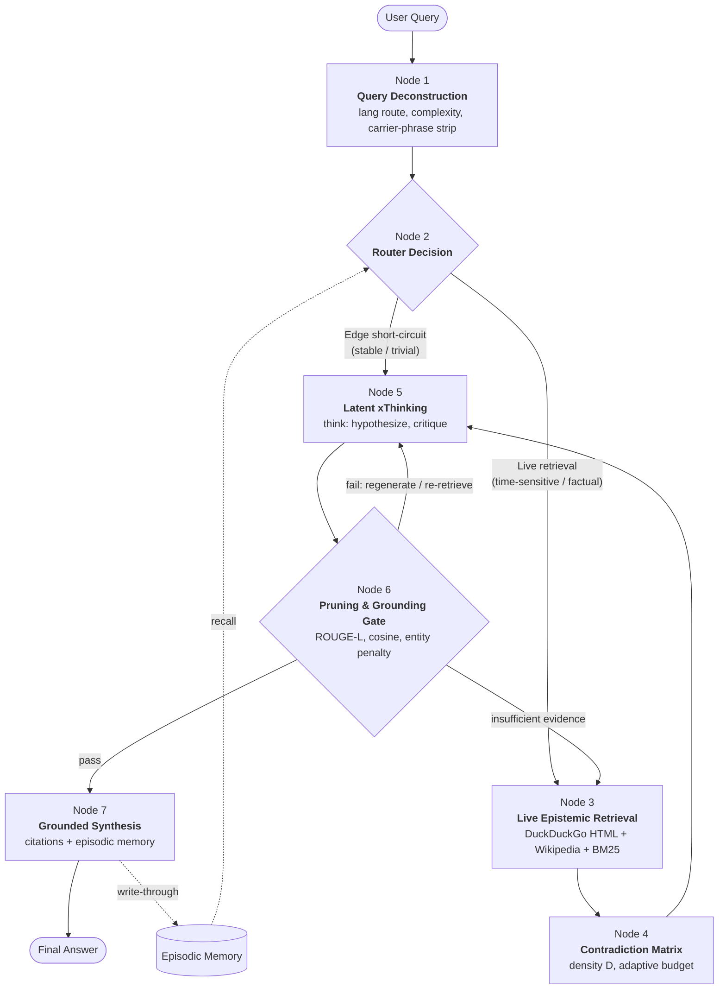
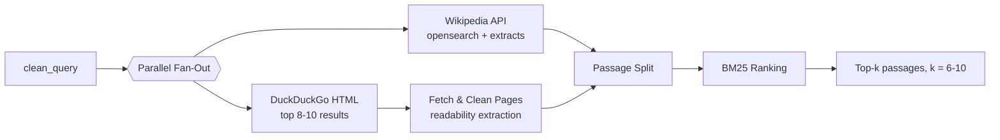
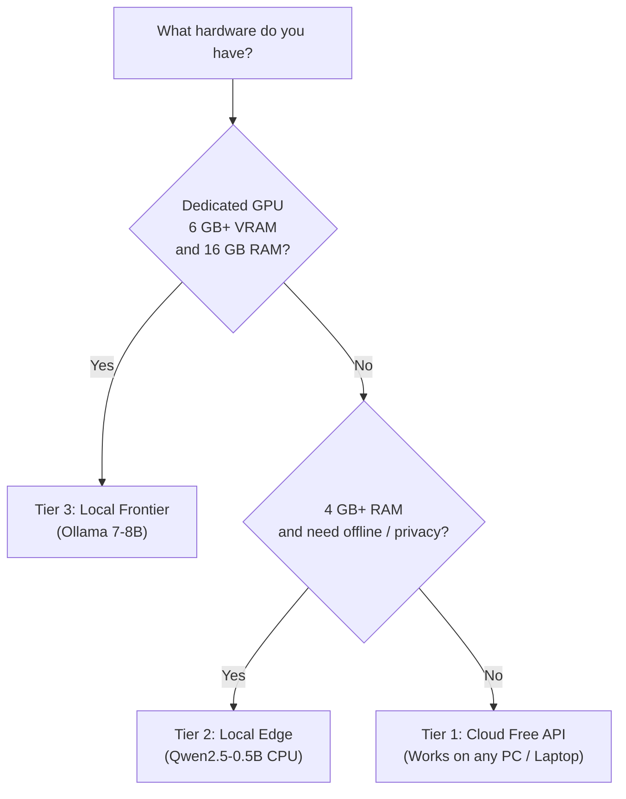

# Genius AI — xThinking Engine Technical Specification

**System:** Genius AI  
**Core Engine:** xThinking Engine  
**Orchestration Layer:** Cognitive State Graph (CSG) v2.0  
**Document Type:** Architecture & Feature Specification  
**Status:** Production-Oriented Design  

> [!NOTE]
> Numeric defaults (thresholds, weights, hardware figures) are recommended starting values. Calibrate them against your own evaluation set before treating them as fixed.

---

## Table of Contents
1. [Executive Summary & Core Philosophy](#1-executive-summary--core-philosophy)
   - [1.1 What is the xThinking Engine?](#11-what-is-the-xthinking-engine)
   - [1.2 Why Step-by-Step Reasoning Beats Shallow Answering](#12-why-step-by-step-reasoning-beats-shallow-answering)
   - [1.3 How Hallucinations are Reduced via Live Epistemic Verification](#13-how-hallucinations-are-reduced-via-live-epistemic-verification)
2. [The 7-Node Cognitive State Graph Architecture](#2-the-7-node-cognitive-state-graph-architecture)
   - [2.1 Architecture Diagram](#21-architecture-diagram)
   - [2.2 Shared State Object](#22-shared-state-object)
   - [Node 1 — Query Deconstruction](#node-1--query-deconstruction)
   - [Node 2 — Router Decision](#node-2--router-decision)
   - [Node 3 — Live Epistemic Retrieval](#node-3--live-epistemic-retrieval)
   - [Node 4 — Contradiction Matrix](#node-4--contradiction-matrix)
   - [Node 5 — Latent xThinking](#node-5--latent-xthinking)
   - [Node 6 — Hallucination Pruning & Grounding Gate](#node-6--hallucination-pruning--grounding-gate)
   - [Node 7 — Grounded Synthesis & Citations](#node-7--grounded-synthesis--citations)
3. [Real-World Live Web Search & Research Capabilities](#3-real-world-live-web-search--research-capabilities)
   - [3.1 Job Search & Career Research](#31-job-search--career-research)
   - [3.2 Deep Research & Intelligence](#32-deep-research--intelligence)
   - [3.3 Coding & Technical Assistance](#33-coding--technical-assistance)
   - [3.4 Shopping & Gadget Comparison](#34-shopping--gadget-comparison)
   - [3.5 Travel & Event Planning](#35-travel--event-planning)
4. [Hardware Compatibility & System Requirements Matrix](#4-hardware-compatibility--system-requirements-matrix)
   - [4.1 Master Comparison Table](#41-master-comparison-table)
   - [4.2 Tier Details](#42-tier-details)
   - [4.3 Final Verdict & Quick Chooser](#43-final-verdict--quick-chooser)
5. [Appendix](#5-appendix)
   - [5.1 Default Configuration](#51-default-configuration)
   - [5.2 Known Limitations](#52-known-limitations)
   - [5.3 Suggested Evaluation Plan](#53-suggested-evaluation-plan)

---

## 1. Executive Summary & Core Philosophy

### 1.1 What is the xThinking Engine?
The **xThinking Engine** is the reasoning core of Genius AI. Instead of mapping a prompt straight to an answer in a single pass, it runs every query through an explicit, inspectable pipeline:
$$\text{Deconstruct} \longrightarrow \text{Decide} \longrightarrow \text{Retrieve} \longrightarrow \text{Cross-Check} \longrightarrow \text{Think} \longrightarrow \text{Verify} \longrightarrow \text{Cite}$$

The pipeline is orchestrated by the **Cognitive State Graph (CSG) v2.0**, a directed graph of seven nodes that share one typed state object.

Two ideas define it:

| Principle | Meaning |
|---|---|
| **Deliberate Reasoning** | The model reasons inside a `<think>...</think>` block (hypotheses, critique, revision) before writing the user-facing answer. |
| **Epistemic Grounding** | Every factual claim in the final answer must be traceable to a retrieved passage, and is scored numerically against that evidence. |

---

### 1.2 Why Step-by-Step Reasoning Beats Shallow Answering

| Dimension | Traditional Single-Pass LLM | xThinking Engine |
|---|---|---|
| **Knowledge Source** | Frozen training data | Live web + Wikipedia at query time |
| **Reasoning** | Implicit, unobservable | Explicit `<think>` trace, streamable and auditable |
| **Multi-step Problems** | Prone to skipped steps | Hypothesis $\to$ Test $\to$ Critique loop |
| **Math / Logic** | Pattern-matched guesses | Steps decomposed and checked; arithmetic delegated to deterministic tools |
| **Conflicting Sources** | Silently picks one | Contradiction matrix quantifies disagreement and raises compute budget |
| **Verifiability** | "Trust me" | Inline citations `[1]`, `[2]` mapped to verified source URLs |
| **Failure Mode** | Confident fabrication | Low-grounding claims are pruned or flagged |

> [!TIP]
> Mathematical grounding here means two things:
> 1. Numeric answers are computed by tools (calculator/code) rather than "recalled".
> 2. Trustworthiness itself is quantified — contradiction density $D$, grounding score $G$, and adaptive token budgets are all governed by explicit mathematical formulas (Section 2).

---

### 1.3 How Hallucinations are Reduced via Live Epistemic Verification
The engine reduces hallucination through four stacked defenses:
1. **Retrieve before asserting**: Time-sensitive or factual queries trigger live retrieval (Node 2 $\to$ Node 3).
2. **Measure disagreement**: Retrieved passages are compared pairwise; high contradiction density forces deeper reasoning and explicit uncertainty (Node 4).
3. **Score every sentence**: Draft claims are checked against evidence using lexical overlap, semantic similarity, and entity preservation (Node 6).
4. **Cite or drop**: Claims below the grounding threshold are removed, rewritten as hedged statements, or flagged (Node 7).

> [!IMPORTANT]
> No system can eliminate hallucination completely. The xThinking Engine substantially lowers the rate and makes the remainder detectable, because each claim carries a score and a source. Answers are only as good as the sources retrieved.

---

## 2. The 7-Node Cognitive State Graph Architecture

### 2.1 Architecture Diagram



---

### 2.2 Shared State Object
Every node reads and writes one typed state, which makes the graph debuggable, testable, and replayable:

```python
from typing import TypedDict, Literal

class CSGState(TypedDict):
    raw_query: str
    clean_query: str
    lang: Literal["en", "hi", "hinglish"]
    complexity: float            # 0.0 .. 1.0
    route: Literal["edge", "live"]
    passages: list[dict]         # {id, url, title, text, bm25, fetched_at}
    contradiction_D: float       # 0.0 .. 1.0
    token_budget: int
    think_trace: str
    draft: str
    claim_scores: list[dict]     # {claim, R, C, E_pen, G, pass}
    final: str
    citations: list[dict]
    trace_id: str
```

---

### Node 1 — Query Deconstruction
**Purpose:** Turn raw user text into a clean, routable, machine-friendly query.

#### Sub-steps

| Step | Technique | Output |
|---|---|---|
| **Language Routing** | Script detection (Devanagari vs Latin) + Hinglish lexicon match (romanized Hindi tokens: *kya, kaise, batao, karo, hai, mujhe, chahiye*) | `lang` $\in$ {`en`, `hi`, `hinglish`} |
| **Carrier-Phrase Stripping** | Regex/lexicon removal of conversational wrappers so search queries stay keyword-dense | `clean_query` |
| **Complexity Scoring** | Weighted features $\to$ score in $[0, 1]$ | `complexity` |
| **Entity & Intent Extraction** | NER + intent classifier (*lookup / compare / how-to / compute / plan*) | `entities`, `intent` |

#### Carrier Phrase Examples

| Language | Raw Input | Stripped Clean Query |
|---|---|---|
| **English** | *"Can you please tell me the latest price of iPhone 16?"* | `latest price iPhone 16` |
| **Hindi** | *"मुझे बताइए कि दिल्ली में आज का मौसम कैसा है"* | `दिल्ली आज मौसम` |
| **Hinglish** | *"bhai mujhe batao Python 3.12 me kya naya aaya hai"* | `Python 3.12 new features` |

#### Complexity Score Formula
$$\text{complexity} = \sigma\big(w_1 \cdot n_{\text{clauses}} + w_2 \cdot n_{\text{entities}} + w_3 \cdot \mathbb{1}_{\text{multi-hop}} + w_4 \cdot \mathbb{1}_{\text{math}} + w_5 \cdot \mathbb{1}_{\text{compare}} - b\big)$$

where $\sigma$ is the logistic sigmoid function.  
**Default weights:** $w = (0.4, 0.3, 0.8, 0.7, 0.5)$, bias $b = 1.2$.

> [!NOTE]
> For search, the original-language query and an English-translated query are both issued when `lang != "en"`, since English sources are often richer for technical topics while Hindi sources matter for local regional news.

---

### Node 2 — Router Decision
**Purpose:** Decide, cheaply, whether the query needs the live web.

| Route | Trigger Conditions | Behavior |
|---|---|---|
| **Edge Short-Circuit** | Greetings, chit-chat, timeless definitions, pure math/logic, rewriting/summarizing user-provided text, cache/episodic-memory hit fresher than TTL | Skips Nodes 3–4, routes directly to Node 5 with reduced token budget |
| **Live Epistemic Retrieval** | Recency markers (*latest, today, 2026, price, news, vs, release, near me*), named entities with volatile facts (people in roles, prices, versions), comparison or research intent, complexity $\ge 0.55$, low model self-confidence | Full pipeline: Nodes 3 $\to$ 4 $\to$ 5 |

#### Decision Function
$$P_{\text{live}} = \sigma\big(a_1 \cdot r_{\text{recency}} + a_2 \cdot r_{\text{volatility}} + a_3 \cdot \text{complexity} + a_4 \cdot (1 - c_{\text{self}}) - a_5 \cdot \mathbb{1}_{\text{mem-hit}} - a_6\big)$$

Route to live if $P_{\text{live}} \ge 0.5$.  
**When in doubt, prefer live:** A wasted search costs milliseconds; an unverified fact costs user trust.

---

### Node 3 — Live Epistemic Retrieval
**Purpose:** Gather fresh, diverse evidence in parallel and rank it.



#### Implementation Notes
- **Concurrency:** `asyncio.gather` with per-source timeout (6 s) and graceful degradation — if one source fails, continue with the other.
- **DuckDuckGo HTML Endpoint:** Request `https://html.duckduckgo.com/html/` with a clean User-Agent, parse result titles/snippets/URLs, and decode redirect links (`uddg=...`).
- **Wikipedia API:** `action=query&list=search` then `prop=extracts&explaintext=1` for clean text.
- **Page Cleaning:** Strip navigation, ads, scripts; split into $\sim 120\text{--}200$ word passages with $\sim 20\%$ overlap.
- **Deduplication:** Near-duplicate removal (MinHash or normalized-text hash) so one syndicated story isn't counted as five sources.
- **Freshness Metadata:** Store `fetched_at` and any publication date detected.

#### BM25 Passage Scoring
$$\text{BM25}(q, p) = \sum_{t \in q} \text{IDF}(t) \cdot \frac{f(t,p) \cdot (k_1 + 1)}{f(t,p) + k_1\left(1 - b + b \cdot \frac{|p|}{\text{avgdl}}\right)}$$

Defaults: $k_1 = 1.5$, $b = 0.75$. Keep the top-$k$ passages, enforcing a source-diversity cap (max 2 passages per domain).

```python
import asyncio
from rank_bm25 import BM25Okapi

async def retrieve(query: str, k: int = 8):
    ddg, wiki = await asyncio.gather(
        search_ddg_html(query, timeout=6),
        search_wikipedia(query, timeout=6),
        return_exceptions=True,
    )
    passages = []
    for src in (ddg, wiki):
        if not isinstance(src, Exception):
            passages += chunk_and_clean(src)
    passages = dedupe(passages)
    bm25 = BM25Okapi([tokenize(p["text"]) for p in passages])
    scores = bm25.get_scores(tokenize(query))
    for p, s in zip(passages, scores):
        p["bm25"] = float(s)
    return diversify(sorted(passages, key=lambda p: -p["bm25"]), max_per_domain=2)[:k]
```

> [!WARNING]
> Scraping the DuckDuckGo HTML endpoint is unofficial: markup can change, and rate limits apply. For enterprise production at scale, keep the scraper behind an adapter interface so you can swap in an official search API (e.g. Brave, Bing, SerpAPI) without modifying the Cognitive State Graph.

---

### Node 4 — Contradiction Matrix
**Purpose:** Measure how much the retrieved sources disagree and spend reasoning effort accordingly.

#### Method
1. Extract atomic claims from each passage (subject–predicate–value triples).
2. Build an $n \times n$ contradiction matrix $M$ over claims addressing the same subject/predicate. Each cell is scored by an NLI model (or LLM judge): `entailment` / `neutral` / `contradiction`.
3. Compute contradiction density $D$.

#### Contradiction Density ($D$)
$$D = \frac{\sum_{i<j} \mathbb{1}\left[\text{contradict}(c_i, c_j)\right] \cdot w_{ij}}{\sum_{i<j} w_{ij}}, \qquad D \in [0, 1]$$

where $w_{ij}$ weights each pair by source credibility (e.g., official/primary sources $>$ forums) and comparability (same subject and predicate).

#### Adaptive Token Budget
$$\text{budget} = \min\Big(B_{\max},\; B_{\text{base}} \cdot (1 + \gamma \cdot D)\Big)$$

| Parameter | Default | Meaning |
|---|---|---|
| $B_{\text{base}}$ | 1024 tokens | Baseline thinking budget |
| $\gamma$ | 2.0 | Sensitivity to disagreement |
| $B_{\max}$ | 4096 tokens | Hard cap (cost/latency guard) |

*Worked Example:* $D = 0.35 \implies \text{budget} = 1024 \cdot (1 + 2 \cdot 0.35) = 1741\text{ tokens}$.

#### Behavioral Consequences

| $D$ Range | Interpretation | Action |
|---|---|---|
| **0.00 – 0.15** | Consensus | Standard budget, confident phrasing |
| **0.15 – 0.40** | Mild disagreement | Larger budget, explicitly note the discrepancy |
| **0.40 – 1.00** | Strong conflict | Maximum budget, present both positions with sources, prefer primary sources, explicit uncertainty statement |

---

### Node 5 — Latent xThinking
**Purpose:** Structured reasoning over the evidence, streamable to the UI.

#### Reasoning Protocol Inside `<think>`
```markdown
<think>
[Understand]  Restate the question and what a correct answer must contain.
[Evidence]    Summarize each passage [1]..[k] with reliability notes.
[Hypotheses]  H1, H2, H3 — candidate answers.
[Test]        For each H: supporting evidence, conflicting evidence.
[Compute]     Any arithmetic → delegated to calculator/code tool.
[Critique]    What could be wrong? Stale data? Source bias? Unit mismatch?
[Decide]      Choose the best-supported hypothesis; note residual uncertainty.
</think>
```

#### Design Rules
- **Streamable CoT:** Tokens between `<think>` tags stream to a collapsible "Thinking…" panel; the final answer streams separately afterwards.
- **Budget Enforcement:** Stop at `token_budget`; force a `[Decide]` step if the cap is reached.
- **Internal Critique Pass:** A mandatory self-review step that lists failure modes before committing to an answer.
- **Tool Delegation:** Arithmetic, unit conversion, and date math go to deterministic tools.
- **Privacy:** The trace is stored per `trace_id` for debugging and can be hidden from end users at the product level.

> [!TIP]
> Show users a summary of reasoning (evidence considered, disagreements found) rather than the raw trace by default; it keeps the UI clean while preserving transparency.

---

### Node 6 — Hallucination Pruning & Grounding Gate
**Purpose:** Verify each claim in the draft against retrieved evidence and prune what isn't supported.

The draft is split into sentence-level claims. Each claim $c$ is compared with its best-matching passage $p^*$.

#### Three Signals

| Signal | Symbol | What it Catches |
|---|---|---|
| **ROUGE-L** (Longest common subsequence F-score) | $R$ | Lexical fidelity to evidence |
| **Cosine Similarity** of sentence embeddings | $C$ | Semantic support even when paraphrased |
| **Entity Preservation Penalty** | $E_{\text{pen}}$ | Wrong or invented names, numbers, dates, units |

#### Entity Penalty Formula
$$E_{\text{pen}} = 1 - \frac{|\mathcal{E}(c) \cap \mathcal{E}(p^*)|}{|\mathcal{E}(c)|}$$

where $\mathcal{E}(\cdot)$ is the set of named entities, numbers, and dates. Numbers must match exactly after normalization (e.g. *"₹1.2 lakh"* = *"120,000 INR"*).

#### Grounding Score Formula
$$G(c) = w_R \cdot R + w_C \cdot C - w_E \cdot E_{\text{pen}}$$

Defaults: $w_R = 0.3,\; w_C = 0.5,\; w_E = 0.4$; pass threshold $\tau = 0.55$.

#### Gate Logic

| Condition | Action |
|---|---|
| $G \ge \tau$ | Keep; attach citation to $p^*$ |
| $\tau_{\text{low}} \le G < \tau$ ($\tau_{\text{low}} = 0.35$) | Rewrite with hedging (*"Sources suggest..."*) or attempt to fix using the passage |
| $G < \tau_{\text{low}}$ or $E_{\text{pen}} > 0.3$ on numeric claims | Prune the claim |
| $> 30\%$ of claims pruned | Loop back: regenerate (Node 5) or re-retrieve with a refined query (Node 3), max 2 loops |

```python
def grounding_gate(draft, passages, tau=0.55, tau_low=0.35):
    results = []
    for claim in split_claims(draft):
        p = best_passage(claim, passages) # by embedding sim
        R = rouge_l_f(claim, p["text"])
        C = cosine(embed(claim), embed(p["text"]))
        E = entity_penalty(claim, p["text"])
        G = 0.3 * R + 0.5 * C - 0.4 * E
        action = "keep" if G >= tau else "hedge" if G >= tau_low and E <= 0.3 else "prune"
        results.append({"claim": claim, "src": p["id"], "G": G, "action": action})
    return results
```

> [!NOTE]
> ROUGE-L alone punishes good paraphrases; cosine similarity alone misses wrong numbers. Combining both with the entity penalty covers each other's blind spots.

---

### Node 7 — Grounded Synthesis & Citations
**Purpose:** Produce the final answer with verifiable citations and learn from the interaction.

#### Output Rules
- Inline numeric citations `[1]`, `[2]` placed after the claim they support.
- A **Sources** list at the end with title, domain, URL, and retrieval time.
- Conflicts stated plainly, with sources on each side.
- Uncertainty labeled (*"as of [date]"*, *"reports differ"*).
- Response language matches the user (English / Hindi / Hinglish).

#### Example Output
```markdown
The Nothing Phone (3) launched with a Snapdragon 8s Gen 4 chip [1], while a second outlet reports a slightly different launch price [2]. Prices in India vary by retailer; treat the figures below as indicative.

**Sources**
[1] example-tech-review.com — "Nothing Phone (3) review" (retrieved 2026-09-28)
[2] example-news.in — "Nothing Phone (3) India pricing" (retrieved 2026-09-28)
```

#### Write-Through Episodic Memory
After synthesis, the engine writes a compact record to SQLite:
```json
{
  "trace_id": "9f3a8b21-41cf-49b8",
  "query_clean": "latest price iPhone 16 India",
  "answer_digest": "iPhone 16 base model starts at ₹79,900...",
  "sources": ["https://apple.com/in/shop/buy-iphone/iphone-16", "https://gadgets360.com/..."],
  "D": 0.12,
  "created_at": "2026-09-28T10:14:00Z",
  "ttl_hours": 6
}
```

**TTL by Volatility:** Prices/news $\to$ 6 hours; Docs/specs $\to$ 72 hours; Encyclopedic facts $\to$ 336 hours (2 weeks).  
On a repeat query, Node 2 can serve from memory if fresh, or re-verify only volatile fields.

> [!IMPORTANT]
> Never store secrets, personal identifiers, or private user data in episodic memory. Store only query text, answer digests, and public source URLs, and give users a way to clear their history.

---

## 3. Real-World Live Web Search & Research Capabilities

### 3.1 Job Search & Career Research

| Capability | Search Pattern | Engine Behavior |
|---|---|---|
| **Live Vacancy Tracking** | `"<role>" jobs "<city>" posted last 7 days` (+ company careers pages) | Aggregates postings from public job boards and career pages; deduplicates cross-posts; extracts title, company, location, experience, posted date |
| **2026 Salary Benchmarks** | `<role> salary <city> 2026`, levels.fyi-style snippets | Collects multiple ranges, reports median/range, flags sample size and source disagreement (high $D$ common here) |
| **Interview Intelligence** | `<company> interview process questions`, engineering blogs | Summarizes typical rounds, frequently reported topics, prep resources |
| **Company Recent Projects** | `<company> product launch OR funding OR engineering blog 2026` | Recent launches, funding, tech stack hints for tailoring applications |

#### Expected Output Format
```markdown
### Senior Backend Engineer — Bengaluru (14 results, last 7 days)

| # | Company | Title | Experience | Posted | Link |
|---|---------|-------|------------|--------|------|
| 1 | Acme Pay | Sr Backend Engineer | 5–8 yrs | 2 days ago | [1] |
| 2 | CloudScale | Distributed Systems Eng | 4–7 yrs | Yesterday | [2] |

**Salary benchmark (indicative, 4 sources, D = 0.28)**
Median ≈ ₹28–36 LPA; ranges differ by company tier and stock component [2][3].
```

> [!WARNING]
> Some job boards restrict scraping in their terms. Prefer public career pages, official APIs, and aggregator sources that permit access. Salary data is self-reported and noisy; the engine should always show ranges and sample counts, never a single "true" number.

---

### 3.2 Deep Research & Intelligence

| Capability | Search Pattern | Engine Behavior |
|---|---|---|
| **Breaking News** | `<topic> news today`, restricted by recency | Multi-outlet cross-check; contradiction matrix highlights conflicting reports early in developing stories |
| **Stock & Market Cap Shifts** | `<ticker> stock price market cap today` | Pulls latest quotes from public finance pages; states timestamp and delay (quotes are often 15+ min delayed) |
| **Competitor Moves** | `<competitor> launch OR pricing OR acquisition 2026` | Timeline of changes with source per event |
| **Academic Papers & Datasets** | `<topic> arXiv 2026`, Semantic Scholar, Hugging Face datasets | Lists paper title, authors, date, abstract gist, dataset links |

#### Expected Output Format
```markdown
**Snapshot (as of 2026-09-28, 10:20 IST — quotes may be delayed)**

| Company | Price | Change | Market Cap | Source |
|---|---|---|---|---|
| Samsung Electronics (005930.KS) | ₩78,200 | +1.4% | $320B | [1] |

**Key Developments**
- Sep 26 — HBM3E memory qualification update announced [2]
- Sep 27 — Reports differ on new foundry deal size: $2.4B [3] vs $3.1B [4]
```

> [!NOTE]
> Market data output is informational only, not financial advice.

---

### 3.3 Coding & Technical Assistance

| Capability | Search Pattern | Engine Behavior |
|---|---|---|
| **Up-to-Date Framework Docs** | `Next.js 15 app router <feature> docs`, `Python 3.12 <feature>` | Prioritizes official documentation domains; records version numbers in the answer |
| **Deprecated Syntax Elimination** | Compares the model's draft code against current docs | Flags removed/renamed APIs (e.g., changed params/cookies() handling in newer Next.js releases) and rewrites |
| **Real-Time Error Fixes** | Exact error string in quotes + library name, GitHub issues, Stack Overflow | Ranks by recency and accepted-solution status; cites the issue or release note |

#### Expected Output Format
```markdown
**Diagnosis:** `Error: Dynamic server usage ...` occurs in Next.js 15 when accessing asynchronous route parameters synchronously [1].

**Fix (verified against Next.js 15.x docs):**
```typescript
// app/page.tsx
export default async function Page({ params }: { params: Promise<{ id: string }> }) {
  const { id } = await params; // params is a Promise in Next.js 15 [1]
  return <div>Item ID: {id}</div>;
}
```
**Deprecated in your snippet:** Synchronous `params.id` access → replaced by `await params` [2].
```

> [!TIP]
> For code, Node 6 adds an AST check: identifiers and function names in generated code must appear in retrieved documentation, or be explicitly marked unverified.

---

### 3.4 Shopping & Gadget Comparison

| Capability | Search Pattern | Engine Behavior |
|---|---|---|
| **New Hardware Specs** | `<device> specifications launch`, manufacturer spec pages | Prefers manufacturer pages for specs; notes regional variants |
| **Multi-Source Review Synthesis** | `<device> review`, several independent outlets | Extracts consistent pros/cons; highlights where reviewers disagree |
| **Side-by-Side Matrices** | Two or more named products | Builds a normalized comparison table with units aligned |

#### Expected Output Format

| Feature | Phone A (Pixel 9 Pro) | Phone B (Galaxy S25) |
|---|---|---|
| **Display** | 6.7" OLED, 120 Hz, 3000 nits [1] | 6.6" Dynamic AMOLED 2X, 120 Hz [2] |
| **Chipset** | Google Tensor G4 [1] | Snapdragon 8 Elite [2] |
| **Battery** | 5060 mAh, 30W wired [1] | 4900 mAh, 45W wired [2] |
| **Price (India)** | ₹1,09,999 [3] | ₹1,04,999 [4] |
| **Reviewers Agree** | Best-in-class computational photography | Superior gaming performance and thermal efficiency |
| **Reviewers Disagree** | Battery life during gaming: mixed reports [5][6] | AI features: useful vs gimmicky [7] |

> [!NOTE]
> Prices differ by retailer, bank offers, and time. The engine reports price ranges with dates, and avoids presenting affiliate or sponsored listings as neutral recommendations.

---

### 3.5 Travel & Event Planning

| Capability | Search Pattern | Engine Behavior |
|---|---|---|
| **Live City Events** | `events in <city> this weekend`, venue/ticketing pages | Lists event, venue, date/time, ticket link; verifies date against venue page |
| **Weekend Concerts** | `<city> concerts <month> 2026` | Groups by date and genre; flags sold-out or rescheduled shows |
| **Flight/Hotel Price Analysis** | `<route> flight prices <dates>`, aggregator snippets | Summarizes typical price bands, cheapest days, and booking-window trends |

#### Expected Output Format
```markdown
**Delhi → Goa, 10–13 Oct (indicative, prices change dynamically)**
- **Flights:** ₹5,800–₹9,200 round trip; cheapest departures on Tue/Wed [1][2]
- **Hotels (3★ North Goa):** ₹2,400–₹4,100/night [3]
- **Live Events:** Sat 11 Oct — International Jazz Festival, Sunburn Arena, tickets via Insider [4]
```

> [!WARNING]
> Dynamic pricing changes minute by minute and search snippets can be volatile. The engine must show the retrieval timestamp and direct users to the official booking page to confirm before purchase.

---

## 4. Hardware Compatibility & System Requirements Matrix

Genius AI is deployable across three flexible tiers so that any machine — from an old 4GB laptop to a multi-GPU server — can run it effectively.

### 4.1 Master Comparison Table

| Attribute | ⚡ Tier 1: Cloud API (Free Tier) <br> *(Default & Universal)* | 💻 Tier 2: Local Edge Offline <br> *(Qwen2.5-0.5B GGUF)* | 🚀 Tier 3: Local Frontier <br> *(Ollama Qwen-7B / Llama-3-8B)* |
|---|---|---|---|
| **Inference Location** | Hosted via OpenRouter / Google AI Studio | Local CPU on your laptop/PC | Local GPU (or CPU, slowly) |
| **RAM (Memory)** | **2–4 GB** (Super-lightweight) | **4–8 GB** | **16 GB+** (32 GB comfortable) |
| **Disk / ROM** | **~500 MB** (App, deps, cache) | **~2.5 GB** (Runtime, model weights, cache) | **~10–20 GB** (Model weights + runtime) |
| **Processor (CPU)** | Any Dual-Core, 2.0 GHz+ | Quad-Core (Intel i3/i5, AMD Ryzen 3/5, M-Series) | Modern 6–8 Core CPU |
| **Graphics (GPU / VRAM)** | **NONE (0 MB VRAM)** | **NONE** (Pure CPU inference) | **6 GB VRAM min** (4-bit 7B); 8–12 GB recommended |
| **Internet Requirement** | Required | Required only for live search (reasoning is 100% offline) | Required only for live search (reasoning is 100% offline) |
| **Live Web Search** | Yes | Yes (when online) | Yes (when online) |
| **Reasoning Quality** | **Frontier 550B** (Nemotron/Gemini level) | Compact / foundational | High, private, zero external limits |
| **Typical Speed** | Fast (network-bound) | $\sim 5\text{--}15$ tokens/s on modern CPU | $\sim 20\text{--}60+$ tokens/s on 6–12 GB GPU |
| **Cost** | **₹0 (100% Free Tiers)** | **₹0** | **₹0 (hardware only)** |
| **Data Privacy** | Prompts sent to provider API | Fully local (except search queries) | Fully local (except search queries) |

> [!NOTE]
> Figures are planning estimates. Real usage depends on quantization level, context length, OS overhead, and background applications. A 4-bit 7–8B model needs roughly 4.5–6 GB for weights, plus KV cache that scales with context window length.

---

### 4.2 Tier Details

#### Tier 1 — Cloud API / Free Tier Mode
- **Setup:** Python 3.10+, free API key from OpenRouter (`:free` models) or Google AI Studio, no GPU drivers needed.
- **What runs locally:** Query deconstruction, router, web scraping, BM25 ranking, contradiction scoring, and grounding gate.
- **Watch for:** Free-tier rate limits, occasional upstream model endpoint changes.
- **Mitigation:** Built-in automatic fallback chain (`nvidia/nemotron-3-ultra-550b-a55b:free` $\to$ `nvidia/nemotron-3.5-lightning:free` $\to$ `google/gemma-4-31b-it:free` $\to$ `Tier 2 Local Edge`).

#### Tier 2 — Local Edge Offline (Qwen2.5-0.5B, CPU)
- **Setup:** `llama.cpp` / `llama-cpp-python` or lightweight PyTorch runtime with a Q4/Q5 quantized model (weights $\approx 0.4\text{--}0.6\text{ GB}$; total package $\approx 2.5\text{ GB}$).
- **Best for:** Complete offline drafting, strict privacy, simple Q&A, and Node 2 edge short-circuit operations.
- **Limits:** 0.5B models have limited complex multi-hop reasoning; rely heavily on Node 3 retrieval and Node 6 grounding gate, keeping $B_{\max} \approx 1024\text{--}2048$.

#### Tier 3 — Local Frontier (Ollama, Qwen-7B / Llama-3-8B)
- **Setup:** Install Ollama (`ollama pull qwen2.5:7b`), NVIDIA GPU with CUDA or Apple Silicon with Unified Memory.
- **VRAM Guide:**
  - **6 GB VRAM:** 7–8B model at 4-bit quantization, short context.
  - **8 GB VRAM:** 7–8B model at 4–5-bit quantization, moderate context (8K–16K).
  - **12 GB+ VRAM:** 7–8B model at 8-bit or extended context (32K+); 14B models at 4-bit.
- **CPU-only fallback:** Works with 16 GB+ RAM, expect $\sim 2\text{--}6$ tokens/s.

---

### 4.3 Final Verdict & Quick Chooser

> [!TIP]
> **Can an old or low-end laptop run Genius AI?**  
> **Yes — absolutely!** Via the Free API mode (Tier 1), any dual-core machine with 2–4 GB RAM, ~500 MB disk, no GPU, and an internet connection runs at full frontier speed, because heavy model inference is handled on cloud servers at zero cost. Local tiers are optional upgrades for 100% offline use and air-gapped privacy.



---

## 5. Appendix

### 5.1 Default Configuration

```yaml
xthinking:
  version: "2.0"
  router:
    live_threshold: 0.5
    prefer_live_when_uncertain: true
  retrieval:
    sources: [duckduckgo_html, wikipedia]
    per_source_timeout_s: 6
    top_k: 8
    max_per_domain: 2
    bm25:
      k1: 1.5
      b: 0.75
  contradiction:
    B_base: 1024
    gamma: 2.0
    B_max: 4096
  grounding:
    weights:
      rouge_l: 0.3
      cosine: 0.5
      entity_penalty: 0.4
    tau_keep: 0.55
    tau_prune: 0.35
    max_regen_loops: 2
  memory:
    ttl_hours:
      news: 6
      prices: 6
      docs: 72
      encyclopedic: 336
  tiers:
    active: cloud_free          # cloud_free | local_edge | local_frontier
    fallback_chain: [cloud_free, local_edge]
```

---

### 5.2 Known Limitations

| Limitation | Impact | Mitigation |
|---|---|---|
| **Scraper Fragility** | Web search can break if HTML markup changes | Multi-tier fallback (DDG HTML $\to$ Lite $\to$ Instant Answer), adapter interface for official search APIs |
| **Source Quality** | Grounded $\neq$ True if the underlying source published false data | Source credibility weighting, primary-source preference, contradiction matrix flags |
| **Small Local Models** | Limited multi-step reasoning at 0.5B | Route complex queries to Tier 1 Cloud API; increase reliance on live retrieval |
| **Retrieval Latency** | Live retrieval adds 1–3 seconds | Parallel `asyncio.gather`, short timeouts, SQLite caching, streaming `<think>` panel |
| **Metric Limits** | ROUGE-L and Cosine can occasionally pass subtly altered claims | Exact entity and numerical value matching penalty ($E_{\text{pen}}$); NLI entailment filter |
| **Legal / ToS** | Scraping policies vary across domains | Respect `robots.txt` and terms of service; prefer open APIs for commercial deployments |

---

### 5.3 Suggested Evaluation Plan

| Metric | How to Measure | Target Benchmark |
|---|---|---|
| **Faithfulness** | Percentage of claims with $G(c) \ge \tau$ on a labeled test set | $> 92\%$ |
| **Citation Precision** | Percentage of citations that directly support their attributed claim | $> 95\%$ |
| **Freshness Accuracy** | Correctness on volatile time-sensitive queries vs ground truth | $> 90\%$ |
| **Hallucination Rate** | Human manual audit of a random sample per release | $< 3\%$ |
| **Latency (p50 / p95)** | End-to-end and per-node execution time tracked via `trace_id` | $\text{p50} < 2.5\text{s},\; \text{p95} < 6.0\text{s}$ |
| **Cost Per Query** | API tokens and bandwidth consumption by tier | **₹0.00** on Tier 1 Free & Tier 2 Local |

---
*End of specification — Genius AI xThinking Engine, CSG v2.0.*
